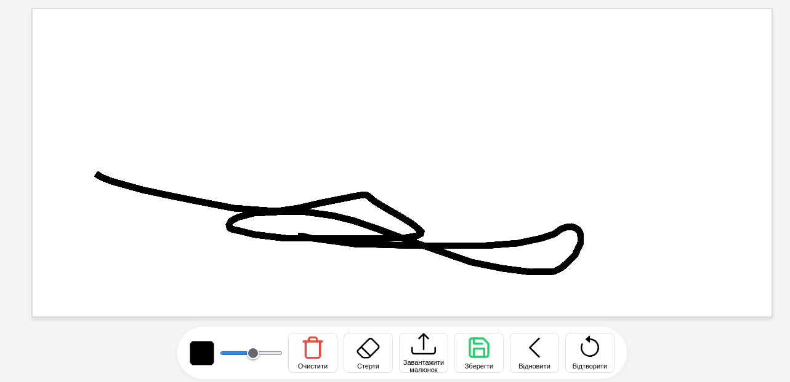

# Canvas
## Paint in browser

## Tech Stack
* **HTML5** — page structure.
* **CSS3** — custom styling.
* **JavaScript** — core application logic.
* **Bootstrap5**  — icons using.

## Project Structure
    index.html — landing page.
    /script.js — simple move control with keyboard keys.
    /style.css — contains simple styles.
